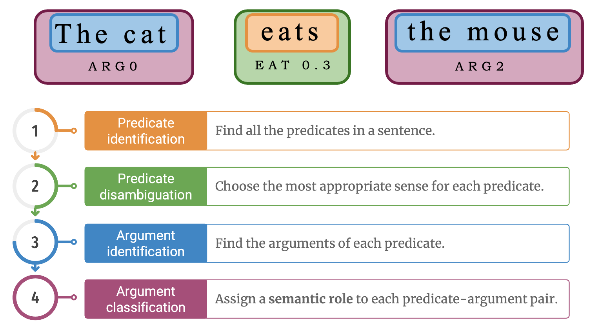

# Semantic Role Labeling using Contextualized Word Embeddings and Attention Layers

Semantic Role Labelling is a taks that consists in assigning to each word in an input sentence labels that indicates their semantic role (such as agent, goal, or result)*. 

When we read a sentence, we are able to identify subject, object and other arguments mainly by looking to the predicate. In the example **“The cat eats the mouse”**, “the cat” is the agent while “the mouse” is the patient. It is therefore sufficient to change the verbal form of the predicate to make the roles reverse. In the sentence  "The mouse is eaten by the cat”, even if the meaning is the same, roles of the two arguments are reversed. Predicates play one of the most important roles in the SRL task. We can picture the prediction process as a pipeline of four steps:

In this work I will only focus on the last 2 tasks.

## Dataset

